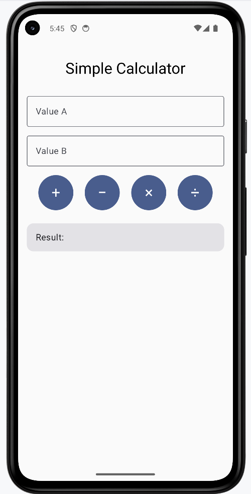
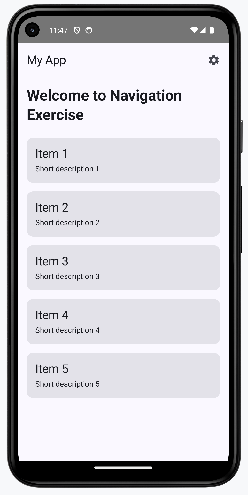
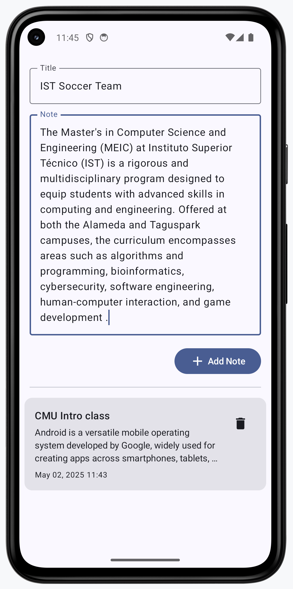

# Mobile and Ubiquitous Computing

## MEIC/METI 2024/2025

# Lab Guide 2

## Jetpack Compose, Navigation & MVVM

---

### Objectives

In this lab, you will explore modern Android development using **Jetpack Compose** for UI, **Jetpack Navigation** for app flow, and **MVVM (Model-View-ViewModel)** for app architecture.

* Build user interfaces using Jetpack Compose, including text inputs, buttons, and reactive text displays.
* Create interactive UI logic by managing state with remember and mutableStateOf.
* Implement basic application navigation using Jetpack Navigation Compose with multiple composable screens and argument passing.
* Understand and apply the MVVM architectural pattern in Android apps using ViewModel, State, and separation of concerns.
* Develop a functional MVVM-based TODO app, demonstrating reactive UI updates from ViewModel state.
* Reinforce Compose-based thinking for layout composition and business logic separation in modern Android development.

This lab is designed for **autonomous learning**: follow the instructions, explore the official documentation when needed, and work at your own pace. You can discuss with colleagues, but each student must complete their own work.

#### Material:

* [Class Slides](slides/cmu-lab2.pdf)

---

## Exercise 1 – Getting Started with Jetpack Compose

Objective: Learn the basics of Jetpack Compose by building a simple calculator UI.



Tasks:

Create a UI with:

* Two TextField components for inputting numbers A and B
* Four Buttons labeled +, −, ×, and ÷ to perform operations
* A Text composable to display the result
* Use remember and mutableStateOf to track:
* The input values
* The selected operation
* The computed result

Ensure proper input validation (e.g., avoid division by zero, handle empty input)

Example Layout Hint:

```kotlin

var a by remember { mutableStateOf("") }
var b by remember { mutableStateOf("") }
var result by remember { mutableStateOf("") }

TextField(value = a, onValueChange = { a = it }, label = { Text("Value A") })
TextField(value = b, onValueChange = { b = it }, label = { Text("Value B") })

Row {
    Button(onClick = { result = (a.toDoubleOrNull() ?: 0.0 + b.toDoubleOrNull() ?: 0.0).toString() }) {
        Text("+")
    }
    // Similarly for -, ×, ÷
}

Text("Result: $result")

```

---

## Exercise 2 - Navigation with Jetpack Compose

Create a multi-screen Android application implementing Jetpack's Navigation component with Compose to handle routing between screens, manage the back stack, and pass data between destinations.



### Requirements

1 - Create a new Android project with Empty Compose Activity template
2 - Add the following dependencies to your app-level build.gradle file:

```kotlin
  val navVersion = "2.9.8"

  // Jetpack Compose integration
  implementation("androidx.navigation:navigation-compose:$navVersion")

  // Views/Fragments integration
  implementation("androidx.navigation:navigation-fragment:$navVersion")
  implementation("androidx.navigation:navigation-ui:$navVersion")

  // Material UI Extended Icons
  implementation("androidx.compose.material:material-icons-extended")
```

3 - Create Activities Composables

### Home Activity

* Display a welcome message and app title
* Show a list of at least 5 items (e.g., products, articles, or tasks)
* Each item should have: a title; short description; an ID (to pass to the Details activity)
* Include a settings button in the top app bar

### Detail Activity

* Display detailed information about a selected item
* Retrieve and show the item ID passed as a navigation parameter
* Show additional information about the item (name, description, etc.)
* Include a "Back" button to return to home activity

### Settings Activity

* Display at least 3 configurable settings (e.g., theme, notifications, language)
* Implement toggle switches or radio buttons for settings
* Include a "Save" button that simulates saving settings

4 - Setup Navigation

Create a NavHost and Define Routes

Create a new Kotlin file called Navigation.kt to manage navigation
Define sealed class for navigation routes and arguments:

```kotlin
sealed class Screen(val route: String) {
    object Home : Screen("home")
    object Detail : Screen("detail/{itemId}") {
        fun createRoute(itemId: Int) = "detail/$itemId"
    }
    object Settings : Screen("settings")
}
```

Set up the NavHost in your MainActivity:

```kotlin
@Composable
fun AppNavigation() {
    val navController = rememberNavController()
    
    NavHost(
        navController = navController,
        startDestination = Screen.Home.route
    ) {
        composable(Screen.Home.route) {
            HomeScreen(
                onItemClick = { itemId ->
                    navController.navigate(Screen.Detail.createRoute(itemId))
                },
                onSettingsClick = {
                    navController.navigate(Screen.Settings.route)
                }
            )
        }
        
        composable(
            route = Screen.Detail.route,
            arguments = listOf(navArgument("itemId") { type = NavType.IntType })
        ) { backStackEntry ->
            val itemId = backStackEntry.arguments?.getInt("itemId") ?: -1
            DetailScreen(
                itemId = itemId,
                onBackClick = {
                    navController.popBackStack()
                }
            )
        }
        
        composable(Screen.Settings.route) {
            SettingsScreen(
                onBackClick = {
                    navController.popBackStack()
                },
                onSaveClick = {
                    // Navigate back to home after saving
                    navController.navigate(Screen.Home.route) {
                        popUpTo(Screen.Home.route) { inclusive = true }
                    }
                }
            )
        }
    }
}
```

Implement Navigation in **MainActivity**

Update your **MainActivity** to use the navigation setup:

```kotlin
class MainActivity : ComponentActivity() {
    override fun onCreate(savedInstanceState: Bundle?) {
        super.onCreate(savedInstanceState)
        setContent {
            YourAppTheme {
                Surface(
                    modifier = Modifier.fillMaxSize(),
                    color = MaterialTheme.colorScheme.background
                ) {
                    AppNavigation()
                }
            }
        }
    }
}
```

Update Screen Composables to Handle Navigation

Modify your HomeScreen to include navigation callbacks:

```kotlin
@OptIn(ExperimentalMaterial3Api::class)
@Composable
fun HomeScreen(
    onItemClick: (Int) -> Unit,
    onSettingsClick: () -> Unit
) {
    Scaffold(
        topBar = {
            TopAppBar(
                title = { Text("My App") },
                actions = {
                    IconButton(onClick = onSettingsClick) {
                        Icon(
                            imageVector = Icons.Default.Settings,
                            contentDescription = "Settings"
                        )
                    }
                }
            )
        }
    ) { paddingValues ->
        // Your home screen content
        // When an item is clicked, call onItemClick(itemId)
    }
}
```

Update DetailScreen to include navigation parameters:

```kotlin
@OptIn(ExperimentalMaterial3Api::class)
@Composable
fun DetailScreen(
    itemId: Int,
    onBackClick: () -> Unit
) {
    Scaffold(
        topBar = {
            TopAppBar(
                title = { Text("Item Details") },
                navigationIcon = {
                    IconButton(onClick = onBackClick) {
                        Icon(
                            imageVector = Icons.AutoMirrored.Filled.ArrowBack,
                            contentDescription = "Back"
                        )
                    }
                }
            )
        }
    ) { paddingValues ->
        // Display item details using the itemId
    }
}
```

Update SettingsScreen with navigation callbacks:

```kotlin
@OptIn(ExperimentalMaterial3Api::class)
@Composable
fun SettingsScreen(
    onBackClick: () -> Unit,
    onSaveClick: () -> Unit
) {
    Scaffold(
        topBar = {
            TopAppBar(
                title = { Text("Settings") },
                navigationIcon = {
                    IconButton(onClick = onBackClick) {
                        Icon(
                            imageVector = Icons.AutoMirrored.Filled.ArrowBack,
                            contentDescription = "Back"
                        )
                    }
                }
            )
        },
        bottomBar = {
            Button(
                onClick = onSaveClick,
                modifier = Modifier
                    .fillMaxWidth()
                    .padding(16.dp)
            ) {
                Text("Save Settings")
            }
        }
    ) { paddingValues ->
        // Your settings UI
    }
}
```

Important Points to Implement:

Make sure to import the necessary navigation dependencies:

```kotlin
import androidx.navigation.NavController
import androidx.navigation.NavType
import androidx.navigation.compose.NavHost
import androidx.navigation.compose.composable
import androidx.navigation.compose.rememberNavController
import androidx.navigation.navArgument
```

Remember to handle the back press properly for a better user experience:

```kotlin

// Handle system back button
BackHandler {
    // Custom back navigation logic if needed
    navController.popBackStack()
}
```

For advanced navigation patterns, consider adding:

* Deep linking support
* Animation transitions between screens
* Shared element transitions if appropriate

Test navigation thoroughly:

* Ensure back stack behaves correctly
* Test passing different parameter values
* Verify that arguments are properly received

---

## Exercise 3 - MVVM

In this exercise, you will build a simple notes application using the MVVM (Model-View-ViewModel) architecture pattern with Jetpack Compose. This exercise will help you understand how to properly separate concerns in Android applications while using modern declarative UI with Compose.





### The MVVM Architecture

MVVM stands for Model-View-ViewModel and is an architectural pattern that helps separate the development of the graphical user interface from the business logic and data of the application.

)

* **Model**: Represents the data and business logic of the application
* **View**: Displays the UI and observes the ViewModel
* **ViewModel**: Acts as a bridge between the Model and View, handling UI-related data and logic

### Project Structure

```

pt.ist.cmu.notesapp/
├── data/
│   ├── model/
│   │   └── Note.kt
│   └── repository/
│       └── NoteRepository.kt
├── ui/
│   ├── components/
│   │   ├── NoteItem.kt
│   │   └── NoteInput.kt
│   ├── screens/
│   │   └── NotesScreen.kt
│   └── theme/
│       └── Theme.kt
└── viewmodel/
    └── NotesViewModel.kt

```

### Part 1: Setting Up the Project

* Step 1: Create a new Android project
* Step 2: Add necessary dependencies
Open your app-level `build.gradle` file and add the following dependencies:

```kotlin

dependencies {
    val lifecycleVersion = "2.10.0"
    val archVersion = "2.2.0"

    // ViewModel
    implementation("androidx.lifecycle:lifecycle-viewmodel-ktx:$lifecycleVersion")
    // ViewModel utilities for Compose
    implementation("androidx.lifecycle:lifecycle-viewmodel-compose:$lifecycleVersion")
    // LiveData
    implementation("androidx.lifecycle:lifecycle-livedata-ktx:$lifecycleVersion")
    // Lifecycles only (without ViewModel or LiveData)
    implementation("androidx.lifecycle:lifecycle-runtime-ktx:$lifecycleVersion")
    // Lifecycle utilities for Compose
    implementation("androidx.lifecycle:lifecycle-runtime-compose:$lifecycleVersion")

    // Saved state module for ViewModel
    implementation("androidx.lifecycle:lifecycle-viewmodel-savedstate:$lifecycleVersion")

    // alternately - if using Java8, use the following instead of lifecycle-compiler
    implementation("androidx.lifecycle:lifecycle-common-java8:$lifecycleVersion")

    // optional - helpers for implementing LifecycleOwner in a Service
    implementation("androidx.lifecycle:lifecycle-service:$lifecycleVersion")

    // optional - ProcessLifecycleOwner provides a lifecycle for the whole application process
    implementation("androidx.lifecycle:lifecycle-process:$lifecycleVersion")

    // optional - ReactiveStreams support for LiveData
    implementation("androidx.lifecycle:lifecycle-reactivestreams-ktx:$lifecycleVersion")

    // optional - Test helpers for LiveData
    testImplementation("androidx.arch.core:core-testing:$archVersion")

    // optional - Test helpers for Lifecycle runtime
    testImplementation ("androidx.lifecycle:lifecycle-runtime-testing:$lifecycleVersion")

    // Material UI Extended Icons
    implementation("androidx.compose.material:material-icons-extended")
    ...

    
}

```


### Part 2: Creating the Model Layer

* Step 1: Define the Note data class. Create a new file `Note.kt` in the `data/model` package:

```kotlin
package pt.ist.cmu.notesapp.data.model

import java.util.Date
import java.util.UUID

data class Note(
    val id: String = UUID.randomUUID().toString(),
    val title: String,
    val content: String,
    val timestamp: Date = Date()
)
```

* Step 2: Create a Repository. Create a new file `NoteRepository.kt` in the `data/repository` package:

```kotlin
package pt.ist.cmu.notesapp.data.repository

import pt.ist.cmu.notesapp.data.model.Note
import kotlinx.coroutines.flow.Flow
import kotlinx.coroutines.flow.MutableStateFlow
import kotlinx.coroutines.flow.asStateFlow
import kotlinx.coroutines.flow.update

class NoteRepository {
    private val _notes = MutableStateFlow<List<Note>>(emptyList())
    val notes: Flow<List<Note>> = _notes.asStateFlow()

    fun addNote(note: Note) {
        _notes.update { currentNotes ->
            currentNotes + note
        }
    }

    fun deleteNote(noteId: String) {
        _notes.update { currentNotes ->
            currentNotes.filter { it.id != noteId }
        }
    }
}
```

### Part 3: Creating the ViewModel

Create a new file `NotesViewModel.kt` in the viewmodel package:

```kotlin
package pt.ist.cmu.notesapp.viewmodel

import androidx.lifecycle.ViewModel
import androidx.lifecycle.viewModelScope
import pt.ist.cmu.notesapp.data.model.Note
import pt.ist.cmu.notesapp.data.repository.NoteRepository
import kotlinx.coroutines.flow.MutableStateFlow
import kotlinx.coroutines.flow.SharingStarted
import kotlinx.coroutines.flow.StateFlow
import kotlinx.coroutines.flow.asStateFlow
import kotlinx.coroutines.flow.stateIn
import kotlinx.coroutines.flow.update

class NotesViewModel(
    private val repository: NoteRepository = NoteRepository()
) : ViewModel() {

    val notes: StateFlow<List<Note>> = repository.notes
        .stateIn(
            scope = viewModelScope,
            started = SharingStarted.WhileSubscribed(5000),
            initialValue = emptyList()
        )

    private val _noteTitle = MutableStateFlow("")
    val noteTitle: StateFlow<String> = _noteTitle.asStateFlow()

    private val _noteContent = MutableStateFlow("")
    val noteContent: StateFlow<String> = _noteContent.asStateFlow()

    fun updateNoteTitle(title: String) {
        _noteTitle.update { title }
    }

    fun updateNoteContent(content: String) {
        _noteContent.update { content }
    }

    fun saveNote() {
        if (_noteTitle.value.isBlank() && _noteContent.value.isBlank()) {
            return
        }
        
        val newNote = Note(
            title = _noteTitle.value,
            content = _noteContent.value
        )
        
        repository.addNote(newNote)
        
        // Clear the input fields
        _noteTitle.update { "" }
        _noteContent.update { "" }
    }

    fun deleteNote(noteId: String) {
        repository.deleteNote(noteId)
    }
}
```

### Part 4: Creating the UI Layer with Jetpack Compose

* Step 1: Create a Note Item Component. Create a new file `NoteItem.kt` in the `ui/components` package:
  
```kotlin
package pt.ist.cmu.notesapp.ui.components

import androidx.compose.foundation.layout.Column
import androidx.compose.foundation.layout.Row
import androidx.compose.foundation.layout.Spacer
import androidx.compose.foundation.layout.fillMaxWidth
import androidx.compose.foundation.layout.height
import androidx.compose.foundation.layout.padding
import androidx.compose.foundation.layout.width
import androidx.compose.material.icons.Icons
import androidx.compose.material.icons.filled.Delete
import androidx.compose.material3.Card
import androidx.compose.material3.Icon
import androidx.compose.material3.IconButton
import androidx.compose.material3.MaterialTheme
import androidx.compose.material3.Text
import androidx.compose.runtime.Composable
import androidx.compose.ui.Alignment
import androidx.compose.ui.Modifier
import androidx.compose.ui.text.style.TextOverflow
import androidx.compose.ui.unit.dp
import pt.ist.cmu.notesapp.data.model.Note
import java.text.SimpleDateFormat
import java.util.Locale

@Composable
fun NoteItem(
    note: Note,
    onDeleteClick: () -> Unit,
    modifier: Modifier = Modifier
) {
    Card(
        modifier = modifier
            .fillMaxWidth()
            .padding(8.dp)
    ) {
        Row(
            modifier = Modifier
                .fillMaxWidth()
                .padding(16.dp),
            verticalAlignment = Alignment.Top
        ) {
            Column(
                modifier = Modifier
                    .weight(1f)
            ) {
                Text(
                    text = note.title,
                    style = MaterialTheme.typography.titleMedium,
                    maxLines = 1,
                    overflow = TextOverflow.Ellipsis
                )
                Spacer(modifier = Modifier.height(4.dp))
                Text(
                    text = note.content,
                    style = MaterialTheme.typography.bodyMedium,
                    maxLines = 3,
                    overflow = TextOverflow.Ellipsis
                )
                Spacer(modifier = Modifier.height(8.dp))
                
                val formattedDate = SimpleDateFormat("MMM dd, yyyy HH:mm", Locale.getDefault())
                    .format(note.timestamp)
                
                Text(
                    text = formattedDate,
                    style = MaterialTheme.typography.bodySmall
                )
            }
            
            Spacer(modifier = Modifier.width(8.dp))
            
            IconButton(onClick = onDeleteClick) {
                Icon(
                    imageVector = Icons.Default.Delete,
                    contentDescription = "Delete Note"
                )
            }
        }
    }
}
```

* Step 2: Create a Note Input Component. Create a new file `NoteInput.kt` in the `ui/components` package:

```kotlin
package pt.ist.cmu.notesapp.ui.components

import androidx.compose.foundation.layout.Column
import androidx.compose.foundation.layout.fillMaxWidth
import androidx.compose.foundation.layout.padding
import androidx.compose.material.icons.Icons
import androidx.compose.material.icons.filled.Add
import androidx.compose.material3.Button
import androidx.compose.material3.Icon
import androidx.compose.material3.OutlinedTextField
import androidx.compose.material3.Text
import androidx.compose.runtime.Composable
import androidx.compose.ui.Alignment
import androidx.compose.ui.Modifier
import androidx.compose.ui.unit.dp

@Composable
fun NoteInput(
    title: String,
    onTitleChange: (String) -> Unit,
    content: String,
    onContentChange: (String) -> Unit,
    onSaveClick: () -> Unit,
    modifier: Modifier = Modifier
) {
    Column(
        modifier = modifier
            .fillMaxWidth()
            .padding(16.dp),
        horizontalAlignment = Alignment.End
    ) {
        OutlinedTextField(
            value = title,
            onValueChange = onTitleChange,
            label = { Text("Title") },
            modifier = Modifier.fillMaxWidth()
        )
        
        OutlinedTextField(
            value = content,
            onValueChange = onContentChange,
            label = { Text("Note") },
            modifier = Modifier
                .fillMaxWidth()
                .padding(top = 8.dp),
            minLines = 3
        )
        
        Button(
            onClick = onSaveClick,
            modifier = Modifier.padding(top = 16.dp)
        ) {
            Icon(
                imageVector = Icons.Default.Add,
                contentDescription = null
            )
            Text(
                text = "Add Note",
                modifier = Modifier.padding(start = 4.dp)
            )
        }
    }
}
```

* Step 3: Create the Notes Screen. Create a new file `NotesScreen.kt` in the `ui/screens` package:


```kotlin

package pt.ist.cmu.notesapp.ui.screens

import androidx.compose.foundation.layout.Column
import androidx.compose.foundation.layout.PaddingValues
import androidx.compose.foundation.layout.fillMaxSize
import androidx.compose.foundation.layout.padding
import androidx.compose.foundation.lazy.LazyColumn
import androidx.compose.foundation.lazy.items
import androidx.compose.material3.Divider
import androidx.compose.material3.MaterialTheme
import androidx.compose.material3.Scaffold
import androidx.compose.material3.Text
import androidx.compose.material3.TopAppBar
import androidx.compose.material3.TopAppBarDefaults
import androidx.compose.runtime.Composable
import androidx.compose.runtime.collectAsState
import androidx.compose.runtime.getValue
import androidx.compose.ui.Modifier
import androidx.compose.ui.unit.dp
import androidx.lifecycle.viewmodel.compose.viewModel
import pt.ist.cmu.notesapp.ui.components.NoteInput
import pt.ist.cmu.notesapp.ui.components.NoteItem
import pt.ist.cmu.notesapp.viewmodel.NotesViewModel

@Composable
fun NotesScreen(
    viewModel: NotesViewModel = viewModel()
) {
    val notes by viewModel.notes.collectAsState()
    val noteTitle by viewModel.noteTitle.collectAsState()
    val noteContent by viewModel.noteContent.collectAsState()

    Scaffold{ paddingValues ->
        Column(
            modifier = Modifier
                .fillMaxSize()
                .padding(paddingValues)
        ) {
            NoteInput(
                title = noteTitle,
                onTitleChange = viewModel::updateNoteTitle,
                content = noteContent,
                onContentChange = viewModel::updateNoteContent,
                onSaveClick = viewModel::saveNote
            )
            
            HorizontalDivider(modifier = Modifier.padding(horizontal = 16.dp))
            
            LazyColumn(
                contentPadding = PaddingValues(vertical = 8.dp)
            ) {
                items(
                    items = notes,
                    key = { it.id }
                ) { note ->
                    NoteItem(
                        note = note,
                        onDeleteClick = { viewModel.deleteNote(note.id) }
                    )
                }
            }
        }
    }
}

```

* Step 4: Update `MainActivity.kt` file to use your `NotesScreen`:

```kotlin
package pt.ist.cmu.notesapp

import android.os.Bundle
import androidx.activity.ComponentActivity
import androidx.activity.compose.setContent
import androidx.compose.foundation.layout.fillMaxSize
import androidx.compose.material3.MaterialTheme
import androidx.compose.material3.Surface
import androidx.compose.ui.Modifier
import pt.ist.cmu.notesapp.ui.screens.NotesScreen
import pt.ist.cmu.notesapp.ui.theme.NotesAppTheme

class MainActivity : ComponentActivity() {
    override fun onCreate(savedInstanceState: Bundle?) {
        super.onCreate(savedInstanceState)
        setContent {
            NotesAppTheme {
                Surface(
                    modifier = Modifier.fillMaxSize(),
                    color = MaterialTheme.colorScheme.background
                ) {
                    NotesScreen()
                }
            }
        }
    }
}
```

## Understanding the MVVM Implementation

### Model Layer

The Note data class represents the data model
The NoteRepository manages the data operations

### ViewModel Layer

The NotesViewModel handles the UI logic and state
It communicates with the repository to perform data operations
It provides state flows for the UI to observe

### View Layer

Jetpack Compose UI components display the data
The UI observes the ViewModel's state and updates accordingly
User interactions are forwarded to the ViewModel
